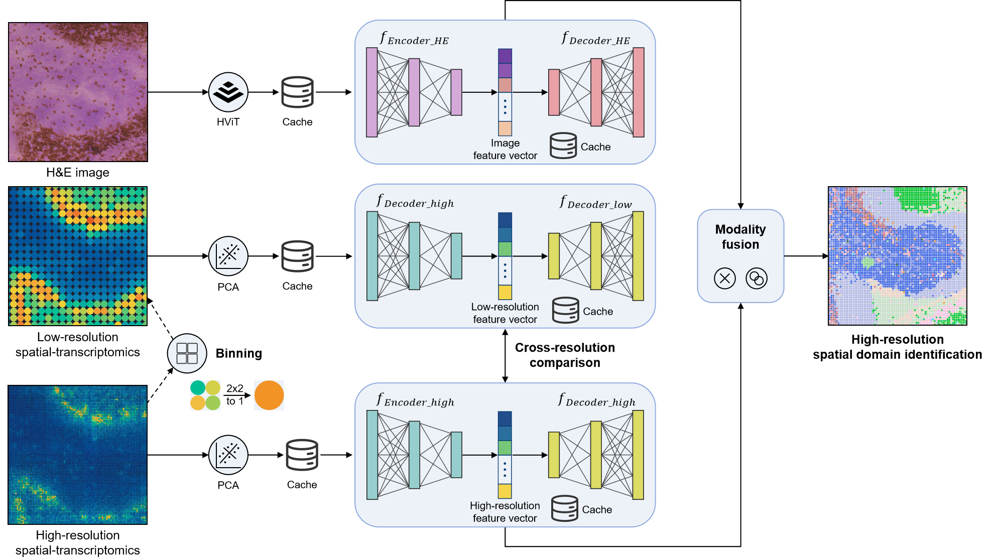

# HESTIA: Histology-Enhanced Scalable cross-Resolution inTegration for spatial trAnscriptomics

HESTIA is a highly efficient multimodal algorithm designed for identifying spatial domains in large-scale, high-resolution spatial omics data.



## Usage

Create an environment and install all the dependencies:

```
mamba env create -f environment.yaml
mamba activate hestia
```

### Model weights

HESTIA extracts H&E image features with HIPT by default. Download the two HIPT checkpoints from the HIPT repository and place them in `src/HIPT_4K/Checkpoints/`:

- `vit256_small_dino.pth` — https://github.com/mahmoodlab/HIPT/blob/master/HIPT_4K/Checkpoints/vit256_small_dino.pth
- `vit4k_xs_dino.pth` — https://github.com/mahmoodlab/HIPT/blob/master/HIPT_4K/Checkpoints/vit4k_xs_dino.pth

Go to `src` folder and run: 
```
python run_multimodal.py \
    -i <input_img> \
    -a <h5ad_file> \
    -o <output_dir> \
    --devices 0 \
    --use_cache \
    --smoothen \
    --n_clusters 10
```
### Important arguments

| Argument           | Required | Default value | Description                                                                                                                                |
| ------------------ | -------- | ------------- | ------------------------------------------------------------------------------------------------------------------------------------------ |
| `-i/--input`       | Yes      |               | Input H&E image file which has been aligned to spatial transcriptomics                                                                     |
| `-a/--h5ad`        | Yes      |               | Input spatial transcriptomics h5ad file                                                                                                    |
| `-o/--output`      | Yes      |               | Output directory                                                                                                                           |
| `--use_cache`      | No       |               | Whether to enable caching                                                                                                                  |
| `--devices`        | No       | 0             | CUDA device(s) to use                                                                                                                      |
| `--smoothen`       | No       |               | Whether to apply smoothing to H&E image, enable it will results in smoother clustering results but may introduce artifects                 |
| `--use_full_image` | No       |               | Do not crop image to tissue region, enable it if the spatial transcriptomics data only covers part of the H&E image                        |
| `--binsize_ratio`  | No       | 2             | Binsize ratio of the dual-autoencoder system used to encode transcriptomics features, you can use larger value for data with lower quality |
| `--n_clusters`     | No       | 10            | Number of clusters for kmeans clustering                                                                                                   |

Full arguments list can be found by running `python run_multimodal.py -h`

### Optional: other foundation models

As an alternative to the default HIPT extractor, HESTIA can extract H&E features with other ViTs (`--model uni|uni2-h|gigapath|virchow2`).

To use these models, fisrt install an extra dependency:

```
mamba install timm
```

For each model, download `config.json` and `pytorch_model.bin` from its Hugging Face repo. Both files are required, and `config.json` must sit in the same directory as `pytorch_model.bin`.

| Model | `--model` | Hugging Face repo |
| --- | --- | --- |
| UNI | `uni` | https://huggingface.co/MahmoodLab/UNI/tree/main |
| UNI2-h | `uni2-h` | https://huggingface.co/MahmoodLab/UNI2-h/tree/main |
| GigaPath | `gigapath` | https://huggingface.co/prov-gigapath/prov-gigapath/tree/main |
| Virchow2 | `virchow2` | https://huggingface.co/paige-ai/Virchow2/tree/main |

Point to the downloaded weights with `--model <name> --ckpt_path <path>/pytorch_model.bin`.

## Input data format requirement

The spatial transcriptomics h5ad data should have the following fields:
1. Raw counts data in `.X`
2. Spatial coordinates in `.obsm["spatial"]`. The spatial coordinate for a square bin is the top left corner of the square bin.

The H&E image data should meet the following requirements:
1. In tiff format
2. Is pre-aligned to spatial transcriptomics data
3. Each pixel corresponds to bin1 in Stereo-Seq data, or 0.5 μm x 0.5 μm square in Visium HD data

## Citation

```
@article{zhong2026hestia,
  title={HESTIA: Scalable Multimodal Integration of Histology and High-Resolution Spatial Transcriptomics for Robust Spatial Domain Identification},
  author={Zhong, Zheng and Zhu, Xiaoyu and Guo, Jing and Liao, Sha and Chen, Ao},
  journal={bioRxiv},
  pages={2026--05},
  year={2026},
  publisher={Cold Spring Harbor Laboratory}
}
```